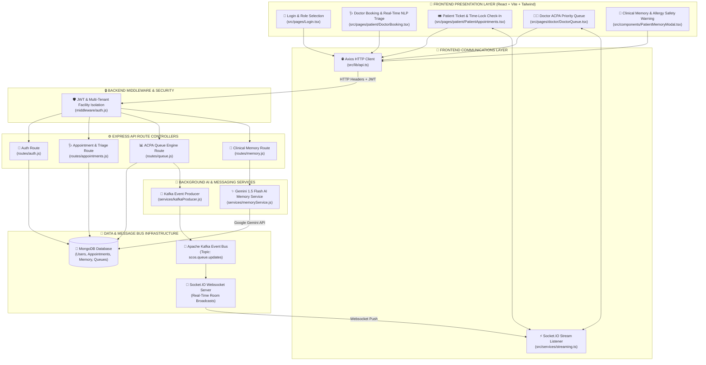
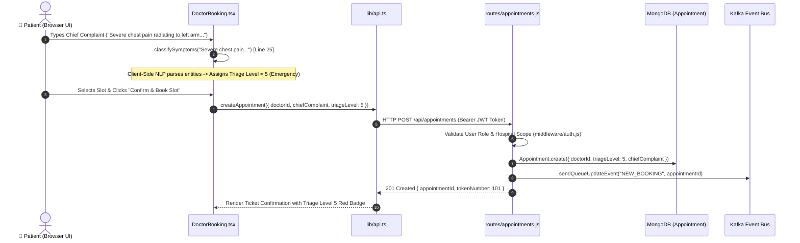
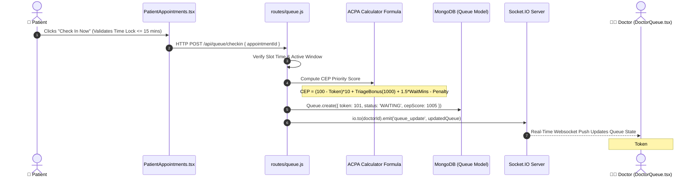

# 🗺️ LIFEFILE — MASTER CODEBASE ROADMAP & ARCHITECTURE BLOCK DIAGRAM
**Platform:** LifeFile (Smart Clinic Operating System / SCOS)  
**SIH 2026 Master System Architecture & Detailed Code Location Reference**

---

## 📐 1. SYSTEM ARCHITECTURE BLOCK DIAGRAM



---

### 🔍 DETAILED EXPLANATION OF EACH SYSTEM BLOCK

---

#### 🟢 Block 1: Frontend Presentation Layer (`scos-frontend/src/pages/`)
* **What it does:** Renders the user interfaces for Patients, Doctors, Hospitals, and Admins. Handles form inputs, real-time UI state updates, and interactive feedback.
* **Key Files & Code Locations:**
  1. `Login.tsx`: Includes 1-Click Role Authentication Pills (`👑 Admin`, `🏥 Hospital`, `👨‍⚕️ Doctor`, `👤 Patient 1/2/3`).
  2. `patient/DoctorBooking.tsx`: Contains `classifySymptoms()` which parses chief complaint text in real-time and illuminates the **Level 5 Emergency Badge**.
  3. `patient/PatientAppointments.tsx`: Computes `isCheckInAllowed()` to enforce the **15-minute Time-Lock Window**.
  4. `doctor/DoctorQueue.tsx`: Renders the dynamically sorted queue array ordered by the ACPA Priority CEP score.
  5. `components/PatientMemoryModal.tsx`: Displays parsed medical history cards with red **CONFLICTED / ALLERGY WARNING** badges.

---

#### 🔵 Block 2: Frontend Communications Layer (`scos-frontend/src/lib/` & `src/services/`)
* **What it does:** Acts as the network bridge between the React frontend and the Node.js backend. Handles HTTP REST requests and persistent WebSocket subscriptions.
* **Key Files & Code Locations:**
  1. `lib/api.ts`: Pre-configured Axios instance with base URL `http://localhost:5000/api` and automatic JWT `Authorization` header injection.
  2. `services/streaming.ts`: Socket.IO client connection manager (`io('http://localhost:5000')`). Listens to `queue_update` events and triggers React state refresh without page reloads.

---

#### 🟣 Block 3: Backend Security & Multi-Tenant Middleware (`scos-backend/middleware/`)
* **What it does:** Intercepts incoming HTTP requests, verifies JSON Web Tokens (JWT), extracts user identity, and enforces strict multi-tenant facility isolation (`hospitalId`).
* **Key Files & Code Locations:**
  1. `middleware/auth.js`: Implements `auth()` for token verification and `requireRole(['doctor', 'hospital'])` for route protection. Prevents unauthorized cross-hospital data access.

---

#### 🟡 Block 4: Express API Route Controllers (`scos-backend/routes/`)
* **What it does:** Handles HTTP endpoint logic, validates request payloads, executes database queries, and computes business algorithms.
* **Key Files & Code Locations:**
  1. `routes/auth.js`: Manages user login and registration with specialist fields (Cardiology, Orthopedics, Pathology).
  2. `routes/appointments.js`: Saves appointments with `chiefComplaint` and `triageLevel` into MongoDB.
  3. `routes/queue.js`: Implements the **ACPA Queue Algorithm** (Lines 35–85), computing CEP priority scores:
     $$\text{CEP} = (100 - \text{Token}) \times 10 + \text{Triage Bonus} + (1.5 \times \text{Wait Mins}) - \text{Skip Penalty}$$
  4. `routes/memory.js`: Manages patient memory cards and allergy conflict resolution routes.

---

#### 🔴 Block 5: Background AI & Messaging Services (`scos-backend/services/`)
* **What it does:** Runs asynchronous background processing, external AI model invocations, and Kafka message publishing.
* **Key Files & Code Locations:**
  1. `services/memoryService.js`:
     * `extractAIMemoryCandidates()` (Lines 293–347): Invokes Google Gemini 1.5 Flash API with JSON schema prompt engineering to parse clinical notes.
     * `isContradictory()` (Lines 17–39): Compares past patient assertions against current notes to detect opposing medical assertions (*"No allergy"* vs *"Penicillin allergy"*).
  2. `services/kafkaProducer.js`: Publishes queue state update events to Apache Kafka.

---

#### 🟤 Block 6: Data & Message Bus Infrastructure Layer
* **What it does:** Persistent database storage and high-throughput real-time message broadcasting.
* **Key Components & Code Locations:**
  1. **MongoDB Database:** Stores `Users`, `Doctors`, `Patients`, `Hospitals`, `Appointments`, `Queues`, and `PatientMemories`.
  2. **Apache Kafka Event Bus:** Topic `scos.queue.updates` decoupled queue state changes from websocket distribution.
  3. **Socket.IO Websocket Server:** `server.js` broadcasts real-time `queue_update` events to scoped client rooms.

---

## ⚡ 2. STEP-BY-STEP CALL TRACES (SEQUENCE DIAGRAMS)

---

### 🟢 Call Trace 1: Patient Booking & Real-Time NLP Triage Execution Flow



---

### 🔵 Call Trace 2: OPD Crowd-Control Check-In & ACPA Dynamic Queue Calculation



---

## 📂 3. COMPLETE DIRECTORY FILE MAP

```text
e:\ie proj\
├── PRESENTATION_FLOW.md                   # 🎤 Master judge speaking points & presentation script
├── PROJECT_DOCUMENTATION_MASTER.md        # 📘 Master technical architecture document
├── PROJECT_CODEBASE_ROADMAP.md            # 🗺️ Codebase block diagram & execution map (THIS FILE)
│
├── scos-backend/                          # ⚙️ Node.js + Express Backend
│   ├── inspect-db.js                      # 📊 CLI Database Inspector (npm run inspect:db)
│   ├── seed-10-distinct.js                # 🕒 24/7 Presentation Seeding Engine
│   ├── server.js                          # 🌐 Server Entrypoint & Socket.IO initialization
│   │
│   ├── middleware/
│   │   └── auth.js                        # 🔒 JWT Authentication & Multi-Tenant Role Isolation
│   │
│   ├── models/                            # 💾 Mongoose Schemas
│   │   ├── User.js                        # System User credentials & roles
│   │   ├── Doctor.js                      # Doctor profile, specializations, schedules
│   │   ├── Patient.js                     # Patient profile & medical history
│   │   ├── Hospital.js                    # Hospital facility metadata & address
│   │   ├── Appointment.js                 # Appointment slots, chief complaints, triage levels
│   │   ├── Queue.js                       # Active OPD Queue tokens & ACPA CEP scores
│   │   └── PatientMemory.js               # Structured medical memory facts & conflict flags
│   │
│   ├── routes/                            # 🚀 REST API Controllers
│   │   ├── auth.js                        # Login, Registration (Specialist selection), Roles
│   │   ├── appointments.js                # Booking, NLP Triage level storage, Status update
│   │   ├── queue.js                       # ACPA priority algorithm, check-in, call next
│   │   ├── memory.js                      # Clinical memory retrieval, conflict resolution
│   │   ├── doctors.js                     # Doctor profiles, search, hospital affiliation
│   │   └── hospitals.js                   # Facility management & doctor roster approvals
│   │
│   └── services/                          # 🧠 Background Services & AI Engines
│       ├── memoryService.js               # Gemini 1.5 Flash AI extraction & conflict check
│       └── kafkaProducer.js               # Kafka message bus producer service
│
└── scos-frontend/                         # 💻 React + TypeScript + Vite Frontend
    ├── src/
    │   ├── lib/
    │   │   └── api.ts                     # Axios HTTP API client for backend communication
    │   │
    │   ├── services/
    │   │   └── streaming.ts               # Socket.IO real-time websocket listener
    │   │
    │   ├── components/
    │   │   └── PatientMemoryModal.tsx     # Clinical memory cards & red allergy alert modal
    │   │
    │   ├── layouts/                       # Navigation sidebars & role layout wrappers
    │   │   ├── AdminLayout.tsx            # System Admin Portal layout
    │   │   ├── DoctorLayout.tsx           # Doctor Clinical Portal layout
    │   │   ├── HospitalLayout.tsx         # Hospital Facility Portal layout
    │   │   └── PatientLayout.tsx          # Patient Portal layout
    │   │
    │   └── pages/                         # Core UI Screen Views
    │       ├── Login.tsx                  # 1-Click Role Login Pills (`/login`)
    │       ├── Register.tsx               # Specialist Doctor / Hospital sign-up
    │       │
    │       ├── patient/
    │       │   ├── SearchDoctors.tsx      # Specialist search & filter (`/patient/search`)
    │       │   ├── DoctorBooking.tsx      # Real-time NLP Triage booking (`/patient/book/:id`)
    │       │   ├── PatientAppointments.tsx# Live digital ticket & time-lock check-in
    │       │   └── SymptomTriage.tsx      # AI NLP Symptom Checker portal (`/patient/triage`)
    │       │
    │       ├── doctor/
    │       │   ├── DoctorQueue.tsx        # ACPA priority queue dashboard
    │       │   └── DoctorSchedule.tsx     # Doctor OPD schedule manager
    │       │
    │       ├── hospital/
    │       │   ├── HospitalDashboard.tsx  # Hospital facility analytics & doctor roster
    │       │   └── DoctorApproval.tsx     # Doctor affiliation request manager
    │       │
    │       └── admin/
    │           ├── AdminDashboard.tsx     # System analytics & usage stats
    │           └── AuditLogs.tsx          # Immutable security audit log view
```

---

## ⚡ 4. HOW TO FIND ANY CODE IN 5 SECONDS DURING JUDGING

| If Judge Asks For: | Open This File: | Key Line Range / Function: |
| :--- | :--- | :--- |
| **"Show me the NLP Triage classifier code"** | `scos-frontend/src/pages/patient/DoctorBooking.tsx` | `classifySymptoms()` (Lines 25–65) |
| **"Show me the backend Gemini AI code"** | `scos-backend/services/memoryService.js` | `extractAIMemoryCandidates()` (Lines 293–347) |
| **"Show me the ACPA Queue Priority formula"** | `scos-backend/routes/queue.js` | CEP Score Calculation (Lines 35–85) |
| **"Show me how allergy conflicts are flagged"** | `scos-backend/services/memoryService.js` | `isContradictory()` (Lines 17–39) |
| **"Show me the Time-Lock Check-In logic"** | `scos-frontend/src/pages/patient/PatientAppointments.tsx` | `isCheckInAllowed()` (Lines 30–55) |
| **"Show me doctor registration specializations"** | `scos-frontend/src/pages/Register.tsx` | Specialization `<select>` dropdown (Lines 120–145) |
| **"Show me Kafka event generation"** | `scos-backend/routes/queue.js` | `kafkaProducer.send()` calls |
| **"Show me Multi-tenant database isolation"** | `scos-backend/middleware/auth.js` | `requireRole()` and `req.user.hospitalId` |
