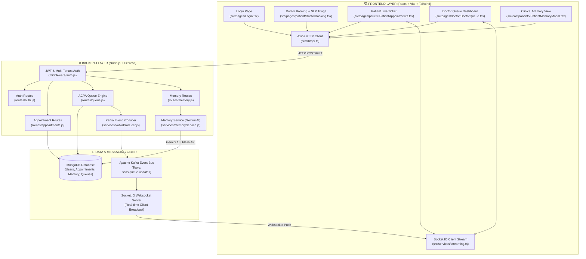

# 🗺️ LIFEFILE — COMPLETE END-TO-END CODEBASE ROADMAP & ARCHITECTURE MAP
**Platform:** LifeFile (Smart Clinic Operating System / SCOS)  
**SIH 2026 Presentation Master Technical Map**

---

## 📐 1. EXECUTIVE END-TO-END ARCHITECTURE DIAGRAM



---

## 🎯 2. COMPLETE FEATURE-BY-FEATURE CODE LOCATION MATRIX

---

### 1️⃣ Real-Time NLP Symptom Triage & Emergency Classifier

* **What it does:** As patients type their chief complaint during booking, client-side & server-side NLP parsers evaluate symptom severity, assigning Triage Levels (1–5) and illuminating emergency badges.
* **Frontend UI File:** [`scos-frontend/src/pages/patient/DoctorBooking.tsx`](file:///e:/ie%20proj/scos-frontend/src/pages/patient/DoctorBooking.tsx)
  * `classifySymptoms(text)` function: Keyword & entity matching logic for Red Code (Level 5) vs Routine (Level 1).
* **Dedicated NLP Page:** [`scos-frontend/src/pages/patient/SymptomTriage.tsx`](file:///e:/ie%20proj/scos-frontend/src/pages/patient/SymptomTriage.tsx)
  * Uses `compromise` NLP library (`import nlp from 'compromise'`) for entity extraction.
* **Backend API Route:** [`scos-backend/routes/appointments.js`](file:///e:/ie%20proj/scos-backend/routes/appointments.js) (POST `/api/appointments`)
  * Stores `chiefComplaint` and `triageLevel` into MongoDB Appointment document.
* **Database Model:** [`scos-backend/models/Appointment.js`](file:///e:/ie%20proj/scos-backend/models/Appointment.js)

---

### 2️⃣ Dynamic Time-Lock Check-In Window (OPD Crowd Control Engine)

* **What it does:** Prevents patients from overcrowding waiting rooms hours early. The **"Check-In / Join Queue"** button stays **LOCKED** until 15 minutes before the booked slot.
* **Frontend UI File:** [`scos-frontend/src/pages/patient/PatientAppointments.tsx`](file:///e:/ie%20proj/scos-frontend/src/pages/patient/PatientAppointments.tsx)
  * `isCheckInAllowed(appointmentTime)`: Checks if current time is within 15 minutes of appointment.
* **Backend API Route:** [`scos-backend/routes/queue.js`](file:///e:/ie%20proj/scos-backend/routes/queue.js) (POST `/api/queue/checkin`)
  * Validates time window server-side and issues token.
* **Database Model:** [`scos-backend/models/Queue.js`](file:///e:/ie%20proj/scos-backend/models/Queue.js)

---

### 3️⃣ Adaptive Clinical Priority Allocation (ACPA Engine)

* **What it does:** Replaces static FIFO queueing. Computes dynamic CEP priority scores combining **Triage Level (+1000 pts for Emergency)**, **Anti-Starvation Aging (+1.5 pts/min)**, and **Missed Call Penalties (-30 pts)**.
* **Backend Core Engine:** [`scos-backend/routes/queue.js`](file:///e:/ie%20proj/scos-backend/routes/queue.js)
  * CEP Score Formula: `(100 - baseToken)*10 + triageBonus + (1.5 * waitMins) - min(missedCalls * 30, 150)`
* **Doctor Queue UI:** [`scos-frontend/src/pages/doctor/DoctorQueue.tsx`](file:///e:/ie%20proj/scos-frontend/src/pages/doctor/DoctorQueue.tsx)
  * Renders dynamically reordered patient list based on CEP priority score.

---

### 4️⃣ Dual Real-Time Event Sync (Kafka + Socket.IO)

* **What it does:** When a doctor clicks "Start Consultation" or "Next Patient", state updates propagate across doctor and patient screens instantly without manual browser refresh.
* **Backend Kafka Producer:** [`scos-backend/routes/queue.js`](file:///e:/ie%20proj/scos-backend/routes/queue.js) (Publishes to `scos.queue.updates`)
* **Backend Socket Server:** [`scos-backend/server.js`](file:///e:/ie%20proj/scos-backend/server.js) (Broadcasts socket events to doctor/patient rooms)
* **Frontend Real-Time Listener:** [`scos-frontend/src/services/streaming.ts`](file:///e:/ie%20proj/scos-frontend/src/services/streaming.ts)
  * Listens to `queue_update` and triggers React state refresh.

---

### 5️⃣ Patient Clinical Memory & Allergy Safety Warnings

* **What it does:** Aggregates past diagnoses and prescriptions into structured memory cards (`ALLERGY`, `CONDITION`, `MEDICATION`). Flags active allergy conflicts with red safety badges before prescriptions are issued.
* **Backend AI Service:** [`scos-backend/services/memoryService.js`](file:///e:/ie%20proj/scos-backend/services/memoryService.js)
  * `extractAIMemoryCandidates()`: Uses `@google/generative-ai` (Gemini 1.5 Flash) with JSON schema validation.
  * `isContradictory()`: Evaluates opposing assertions (e.g. *"no known allergy"* vs *"penicillin allergy"*).
* **Backend API Route:** [`scos-backend/routes/memory.js`](file:///e:/ie%20proj/scos-backend/routes/memory.js)
* **Frontend Component:** [`scos-frontend/src/components/PatientMemoryModal.tsx`](file:///e:/ie%20proj/scos-frontend/src/components/PatientMemoryModal.tsx)
* **Database Model:** [`scos-backend/models/PatientMemory.js`](file:///e:/ie%20proj/scos-backend/models/PatientMemory.js)

---

### 6️⃣ Multi-Tenant Facility Data Isolation

* **What it does:** Scopes all doctor queues, patient records, and hospital rosters strictly to the active hospital facility context (`hospitalId`), ensuring complete security & zero data leakage across hospital networks.
* **Backend Middleware:** [`scos-backend/middleware/auth.js`](file:///e:/ie%20proj/scos-backend/middleware/auth.js)
  * Evaluates JWT claims (`req.user.role`, `req.user.hospitalId`).
* **Frontend Layout Scoping:**
  * Admin Layout: [`scos-frontend/src/layouts/AdminLayout.tsx`](file:///e:/ie%20proj/scos-frontend/src/layouts/AdminLayout.tsx)
  * Doctor Layout: [`scos-frontend/src/layouts/DoctorLayout.tsx`](file:///e:/ie%20proj/scos-frontend/src/layouts/DoctorLayout.tsx)
  * Hospital Layout: [`scos-frontend/src/layouts/HospitalLayout.tsx`](file:///e:/ie%20proj/scos-frontend/src/layouts/HospitalLayout.tsx)

---

### 7️⃣ Live Database CLI Inspection Matrix Tool

* **What it does:** Terminal inspection tool for technical judges to view real-time ASCII tabular database state (Users, Queue Tokens, Priority Scores, Memory Cards, Audit Trail).
* **Root Script File:** [`scos-backend/inspect-db.js`](file:///e:/ie%20proj/scos-backend/inspect-db.js)
* **Terminal Command:** `npm run inspect:db`

---

### 8️⃣ 24/7 Time-Independent Presentation Seeding Engine

* **What it does:** Recalculates all demo appointment slots dynamically relative to the exact moment of execution (`NOW - 10m`, `NOW + 5m`, `NOW + 45m`), guaranteeing presentation readiness 24/7.
* **Root Script File:** [`scos-backend/seed-10-distinct.js`](file:///e:/ie%20proj/scos-backend/seed-10-distinct.js)
* **Terminal Command:** `npm run seed:presentation -- --confirm`

---

## 📂 3. DIRECTORY MAP & FILE INDEX

```text
e:\ie proj\
├── PRESENTATION_FLOW.md                   # 🎤 Master judge speaking points & presentation script
├── PROJECT_DOCUMENTATION_MASTER.md        # 📘 Master technical architecture document
├── PROJECT_CODEBASE_ROADMAP.md            # 🗺️ Codebase location map (THIS FILE)
│
├── scos-backend/                          # ⚙️ Node.js + Express Backend
│   ├── inspect-db.js                      # 📊 CLI Database Inspector (npm run inspect:db)
│   ├── seed-10-distinct.js                # 🕒 24/7 Presentation Seeding Engine
│   ├── server.js                          # 🌐 Server Entrypoint & Socket.IO initialization
│   │
│   ├── middleware/
│   │   └── auth.js                        # 🔒 JWT Authentication & Multi-Tenant Role Isolation
│   │
│   ├── models/                            # 💾 Mongoose Data Schemas
│   │   ├── User.js                        # System User credentials & roles
│   │   ├── Doctor.js                      # Doctor profile, specializations, schedules
│   │   ├── Patient.js                     # Patient profile & medical history
│   │   ├── Hospital.js                    # Hospital facility metadata & address
│   │   ├── Appointment.js                 # Appointment slots, chief complaints, triage levels
│   │   ├── Queue.js                       # Active OPD Queue tokens & ACPA CEP scores
│   │   └── PatientMemory.js               # Structured medical memory facts & conflict flags
│   │
│   ├── routes/                            # 🚀 REST API Route Controllers
│   │   ├── auth.js                        # Login, Registration (Specialist selection), Roles
│   │   ├── appointments.js                # Booking, NLP Triage level storage, Status update
│   │   ├── queue.js                       # ACPA priority algorithm, check-in, call next
│   │   ├── memory.js                      # Clinical memory retrieval, conflict resolution
│   │   ├── doctors.js                     # Doctor profiles, search, hospital affiliation
│   │   └── hospitals.js                   # Facility management & doctor roster approvals
│   │
│   └── services/                          # 🧠 Background Business Logic & AI Engines
│       ├── memoryService.js               # Gemini 1.5 Flash AI extraction & conflict check
│       └── kafkaProducer.js               # Kafka message bus producer service
│
└── scos-frontend/                         # 💻 React + TypeScript + Vite Frontend
    ├── src/
    │   ├── lib/
    │   │   └── api.ts                     # Axios HTTP API client for backend communication
    │   │
    │   ├── services/
    │   │   └── streaming.ts               # Socket.IO real-time websocket listener
    │   │
    │   ├── components/
    │   │   └── PatientMemoryModal.tsx     # Clinical memory cards & red allergy alert modal
    │   │
    │   ├── layouts/                       # Navigation sidebars & role layout wrappers
    │   │   ├── AdminLayout.tsx            # System Admin Portal layout
    │   │   ├── DoctorLayout.tsx           # Doctor Clinical Portal layout
    │   │   ├── HospitalLayout.tsx         # Hospital Facility Portal layout
    │   │   └── PatientLayout.tsx          # Patient Portal layout
    │   │
    │   └── pages/                         # Core UI Screen Views
    │       ├── Login.tsx                  # 1-Click Role Login Pills (`/login`)
    │       ├── Register.tsx               # Specialist Doctor / Hospital sign-up
    │       │
    │       ├── patient/
    │       │   ├── SearchDoctors.tsx      # Specialist search & filter (`/patient/search`)
    │       │   ├── DoctorBooking.tsx      # Real-time NLP Triage booking (`/patient/book/:id`)
    │       │   ├── PatientAppointments.tsx# Live digital ticket & time-lock check-in
    │       │   └── SymptomTriage.tsx      # AI NLP Symptom Checker portal (`/patient/triage`)
    │       │
    │       ├── doctor/
    │       │   ├── DoctorQueue.tsx        # ACPA priority queue dashboard
    │       │   └── DoctorSchedule.tsx     # Doctor OPD schedule manager
    │       │
    │       ├── hospital/
    │       │   ├── HospitalDashboard.tsx  # Hospital facility analytics & doctor roster
    │       │   └── DoctorApproval.tsx     # Doctor affiliation request manager
    │       │
    │       └── admin/
    │           ├── AdminDashboard.tsx     # System analytics & usage stats
    │           └── AuditLogs.tsx          # Immutable security audit log view
```

---

## ⚡ 4. HOW TO FIND ANY CODE IN 5 SECONDS DURING JUDGING

| If Judge Asks For: | Open This File: | Key Line Range / Function: |
| :--- | :--- | :--- |
| **"Show me the NLP Triage classifier code"** | `scos-frontend/src/pages/patient/DoctorBooking.tsx` | `classifySymptoms()` (Lines 25–65) |
| **"Show me the backend Gemini AI code"** | `scos-backend/services/memoryService.js` | `extractAIMemoryCandidates()` (Lines 293–347) |
| **"Show me the ACPA Queue Priority formula"** | `scos-backend/routes/queue.js` | CEP Score Calculation (Lines 35–85) |
| **"Show me how allergy conflicts are flagged"** | `scos-backend/services/memoryService.js` | `isContradictory()` (Lines 17–39) |
| **"Show me the Time-Lock Check-In logic"** | `scos-frontend/src/pages/patient/PatientAppointments.tsx` | `isCheckInAllowed()` (Lines 30–55) |
| **"Show me doctor registration specializations"** | `scos-frontend/src/pages/Register.tsx` | Specialization `<select>` dropdown (Lines 120–145) |
| **"Show me Kafka event generation"** | `scos-backend/routes/queue.js` | `kafkaProducer.send()` calls |
| **"Show me Multi-tenant database isolation"** | `scos-backend/middleware/auth.js` | `requireRole()` and `req.user.hospitalId` |
