# 🗺️ LIFEFILE — SYSTEM ARCHITECTURE BLOCK DIAGRAM & CODE ROADMAP
**Platform:** LifeFile (Smart Clinic Operating System / SCOS)  
**SIH 2026 Presentation Master System Architecture**

---

## 📦 1. SYSTEM ARCHITECTURE VISUAL BLOCK DIAGRAM

### 📺 Visual Box Art Layout

```text
+----------------------------------------------------------------------------------------------------+
|                                    1. FRONTEND PRESENTATION BLOCK                                  |
|  +---------------------+  +-------------------------+  +-------------------+  +-----------------+  |
|  |     Login.tsx       |  |    DoctorBooking.tsx     |  |  DoctorQueue.tsx  |  | PatientAppt.tsx |  |
|  | (1-Click Auth Pills)|  | (NLP Triage Classifier) |  | (ACPA Queue View) |  | (Time Lock UI)  |  |
|  +---------------------+  +-------------------------+  +-------------------+  +-----------------+  |
+----------------------------------------------------------------------------------------------------+
                                                  |
                                    (HTTP REST API + WebSockets)
                                                  v
+----------------------------------------------------------------------------------------------------+
|                                  2. COMMUNICATIONS & GATEWAY BLOCK                                 |
|  +--------------------------------------------------+  +----------------------------------------+  |
|  |            Axios API Client (lib/api.ts)         |  |   Socket.IO Stream (services/stream.ts)|  |
|  +--------------------------------------------------+  +----------------------------------------+  |
+----------------------------------------------------------------------------------------------------+
                                                  |
                                                  v
+----------------------------------------------------------------------------------------------------+
|                                   3. BACKEND SECURITY & AUTH BLOCK                                 |
|  +----------------------------------------------------------------------------------------------+  |
|  |                 JWT Token Authentication & Multi-Tenant Isolation (middleware/auth.js)          |  |
|  +----------------------------------------------------------------------------------------------+  |
+----------------------------------------------------------------------------------------------------+
                                                  |
                                                  v
+----------------------------------------------------------------------------------------------------+
|                                 4. EXPRESS API ROUTE CONTROLLERS BLOCK                             |
|  +-------------------+  +--------------------------+  +------------------+  +-------------------+  |
|  |      auth.js      |  |     appointments.js      |  |     queue.js     |  |     memory.js     |  |
|  | (Doctor Register) |  | (Triage Level Recording) |  | (ACPA CEP Engine)|  | (Memory Endpoint) |  |
|  +-------------------+  +--------------------------+  +------------------+  +-------------------+  |
+----------------------------------------------------------------------------------------------------+
                                                  |
                                                  v
+----------------------------------------------------------------------------------------------------+
|                                  5. BACKGROUND AI & ENGINE SERVICES BLOCK                          |
|  +--------------------------------------------------+  +----------------------------------------+  |
|  |   Google Gemini 1.5 Flash (services/memory.js)   |  |   Kafka Producer (services/kafka.js)   |  |
|  |   - NLP Entity Extractor                         |  |   - Queue Event Pipeline               |  |
|  |   - Allergy Contradiction Classifier             |  |                                        |  |
|  +--------------------------------------------------+  +----------------------------------------+  |
+----------------------------------------------------------------------------------------------------+
                                                  |
                                                  v
+----------------------------------------------------------------------------------------------------+
|                                 6. DATA STORAGE & MESSAGING BUS BLOCK                              |
|  +----------------------------------+  +----------------------------+  +------------------------+  |
|  |         MongoDB Database         |  |      Apache Kafka Bus      |  |   Socket.IO Websocket  |  |
|  | (Users, Appts, Queues, Memories)|  |   (Topic: scos.queue.updates) |  |   (Real-Time Rooms)    |  |
|  +----------------------------------+  +----------------------------+  +------------------------+  |
+----------------------------------------------------------------------------------------------------+
```

---

### 🎨 Mermaid Block Graph

```mermaid
flowchart TD
    subgraph B1 ["📦 BLOCK 1: FRONTEND PRESENTATION LAYER"]
        UI_Login["[ BLOCK 1A: Login & Auth Pills ]\nFile: src/pages/Login.tsx"]
        UI_Booking["[ BLOCK 1B: NLP Triage Booking ]\nFile: src/pages/patient/DoctorBooking.tsx"]
        UI_Queue["[ BLOCK 1C: Doctor Queue Dashboard ]\nFile: src/pages/doctor/DoctorQueue.tsx"]
        UI_Appt["[ BLOCK 1D: Patient Ticket & Time Lock ]\nFile: src/pages/patient/PatientAppointments.tsx"]
    end

    subgraph B2 ["📦 BLOCK 2: COMMUNICATIONS LAYER"]
        API_Client["[ BLOCK 2A: Axios HTTP Client ]\nFile: src/lib/api.ts"]
        Socket_Client["[ BLOCK 2B: Socket.IO Stream Listener ]\nFile: src/services/streaming.ts"]
    end

    subgraph B3 ["📦 BLOCK 3: SECURITY & AUTH MIDDLEWARE"]
        Auth_Middleware["[ BLOCK 3A: JWT & Multi-Tenant Guard ]\nFile: middleware/auth.js"]
    end

    subgraph B4 ["📦 BLOCK 4: EXPRESS API CONTROLLERS"]
        Route_Auth["[ BLOCK 4A: Auth Route ]\nFile: routes/auth.js"]
        Route_Appt["[ BLOCK 4B: Appointment Route ]\nFile: routes/appointments.js"]
        Route_Queue["[ BLOCK 4C: ACPA Queue Engine ]\nFile: routes/queue.js"]
        Route_Mem["[ BLOCK 4D: Clinical Memory Route ]\nFile: routes/memory.js"]
    end

    subgraph B5 ["📦 BLOCK 5: BACKGROUND AI & ENGINES"]
        Service_AI["[ BLOCK 5A: Gemini 1.5 Flash AI ]\nFile: services/memoryService.js"]
        Service_Kafka["[ BLOCK 5B: Kafka Message Producer ]\nFile: services/kafkaProducer.js"]
    end

    subgraph B6 ["📦 BLOCK 6: DATA & MESSAGING INFRASTRUCTURE"]
        DB["[ BLOCK 6A: MongoDB Store ]\nCollections: Users, Appointments, Memory, Queues"]
        Kafka["[ BLOCK 6B: Apache Kafka Bus ]\nTopic: scos.queue.updates"]
        Socket["[ BLOCK 6C: Socket.IO Server ]\nReal-Time Client Broadcast Rooms"]
    end

    B1 --> B2
    B2 --> B3
    B3 --> B4
    B4 --> B5
    B5 --> B6
```



---

## 🔍 2. DETAILED EXPLANATION OF EVERY ARCHITECTURE BLOCK

---

### 🟢 BLOCK 1: FRONTEND PRESENTATION LAYER (`scos-frontend/src/pages/`)
* **Block Purpose:** Renders the user interfaces for Patients, Doctors, Hospitals, and Admins.
* **Component 1A (Login.tsx):** Implements 1-Click Role Login Pills for judge demos.
* **Component 1B (DoctorBooking.tsx):** Executes client-side NLP symptom parsing via `classifySymptoms()` to detect Emergency Level 5 cases.
* **Component 1C (DoctorQueue.tsx):** Renders the doctor's queue dynamically sorted by ACPA CEP score.
* **Component 1D (PatientAppointments.tsx):** Evaluates slot times via `isCheckInAllowed()` to enforce 15-minute OPD time locks.

---

### 🔵 BLOCK 2: COMMUNICATIONS & GATEWAY LAYER (`scos-frontend/src/lib/` & `src/services/`)
* **Block Purpose:** Handles network transport, REST API communication, and WebSocket streaming.
* **Component 2A (lib/api.ts):** Axios client configured with base URL `http://localhost:5000/api` and automatic JWT header injection.
* **Component 2B (services/streaming.ts):** Socket.IO listener handling `queue_update` events for zero-refresh UI updates.

---

### 🟣 BLOCK 3: BACKEND SECURITY & AUTH MIDDLEWARE (`scos-backend/middleware/`)
* **Block Purpose:** Protects REST routes and enforces multi-tenant facility data isolation.
* **Component 3A (middleware/auth.js):** Decodes JWT tokens, verifies user roles (`doctor`, `hospital`, `patient`), and scopes query results to `req.user.hospitalId`.

---

### 🟡 BLOCK 4: EXPRESS API ROUTE CONTROLLERS (`scos-backend/routes/`)
* **Block Purpose:** Executes REST route handlers and core algorithms.
* **Component 4A (routes/auth.js):** Handles registration with doctor specialization fields (Cardiology, Orthopedics, Pathology).
* **Component 4B (routes/appointments.js):** Saves appointment bookings with `chiefComplaint` and `triageLevel`.
* **Component 4C (routes/queue.js):** Computes ACPA CEP priority score formula:
  $$\text{CEP} = (100 - \text{Token}) \times 10 + \text{Triage Bonus} + (1.5 \times \text{Wait Mins}) - \text{Skip Penalty}$$
* **Component 4D (routes/memory.js):** Exposes endpoints for patient medical history retrieval.

---

### 🔴 BLOCK 5: BACKGROUND AI & SERVICES LAYER (`scos-backend/services/`)
* **Block Purpose:** Manages Google Gemini AI integration, NLP conflict detection, and message queues.
* **Component 5A (services/memoryService.js):**
  * `extractAIMemoryCandidates()` (Lines 293–347): Invokes Google Gemini 1.5 Flash API with JSON schema prompt engineering.
  * `isContradictory()` (Lines 17–39): Evaluates medical term contradictions (*"No allergy"* vs *"Penicillin allergy"*).
* **Component 5B (services/kafkaProducer.js):** Publishes queue state transitions to Apache Kafka.

---

### 🟤 BLOCK 6: DATA & MESSAGING INFRASTRUCTURE LAYER
* **Block Purpose:** Persistent database storage and real-time event broadcasting.
* **Component 6A (MongoDB):** Database housing Users, Doctors, Patients, Hospitals, Appointments, Queues, and Memories.
* **Component 6B (Apache Kafka):** Topic `scos.queue.updates` providing decoupled message event streaming.
* **Component 6C (Socket.IO Server):** Broadcasts real-time events to active browser sessions.

---

## 📂 3. COMPLETE DIRECTORY FILE INDEX

```text
e:\ie proj\
├── PRESENTATION_FLOW.md                   # 🎤 Master presentation script
├── PROJECT_DOCUMENTATION_MASTER.md        # 📘 Master technical documentation
├── PROJECT_CODEBASE_ROADMAP.md            # 🗺️ Architecture block diagram (THIS FILE)
│
├── scos-backend/                          # ⚙️ Backend Node.js Service
│   ├── inspect-db.js                      # 📊 CLI Database Inspector (npm run inspect:db)
│   ├── seed-10-distinct.js                # 🕒 Presentation Seeding Engine
│   ├── server.js                          # 🌐 Express & Socket.IO Entrypoint
│   ├── middleware/auth.js                 # 🔒 Multi-Tenant Auth Middleware
│   ├── models/                            # 💾 Database Models
│   │   ├── User.js, Doctor.js, Patient.js, Hospital.js, Appointment.js, Queue.js, PatientMemory.js
│   ├── routes/                            # 🚀 REST API Controllers
│   │   ├── auth.js, appointments.js, queue.js, memory.js, doctors.js, hospitals.js
│   └── services/                          # 🧠 AI & Message Services
│       ├── memoryService.js (Gemini AI), kafkaProducer.js
│
└── scos-frontend/                         # 💻 Frontend React Application
    ├── src/lib/api.ts                     # Axios API Client
    ├── src/services/streaming.ts          # Socket.IO Listener
    ├── src/components/PatientMemoryModal.tsx # Memory UI Modal
    └── src/pages/                         # Core UI Views
        ├── Login.tsx, Register.tsx, SearchDoctors.tsx, DoctorBooking.tsx, PatientAppointments.tsx, DoctorQueue.tsx
```

---

## ⚡ 4. HOW TO FIND ANY CODE IN 5 SECONDS DURING JUDGING

| If Judge Asks For: | Open This File: | Key Line Range / Function: |
| :--- | :--- | :--- |
| **"Show me the NLP Triage classifier code"** | `scos-frontend/src/pages/patient/DoctorBooking.tsx` | `classifySymptoms()` (Lines 25–65) |
| **"Show me the backend Gemini AI code"** | `scos-backend/services/memoryService.js` | `extractAIMemoryCandidates()` (Lines 293–347) |
| **"Show me the ACPA Queue Priority formula"** | `scos-backend/routes/queue.js` | CEP Score Calculation (Lines 35–85) |
| **"Show me how allergy conflicts are flagged"** | `scos-backend/services/memoryService.js` | `isContradictory()` (Lines 17–39) |
| **"Show me the Time-Lock Check-In logic"** | `scos-frontend/src/pages/patient/PatientAppointments.tsx` | `isCheckInAllowed()` (Lines 30–55) |
| **"Show me doctor registration specializations"** | `scos-frontend/src/pages/Register.tsx` | Specialization `<select>` dropdown (Lines 120–145) |
| **"Show me Kafka event generation"** | `scos-backend/routes/queue.js` | `kafkaProducer.send()` calls |
| **"Show me Multi-tenant database isolation"** | `scos-backend/middleware/auth.js` | `requireRole()` and `req.user.hospitalId` |
