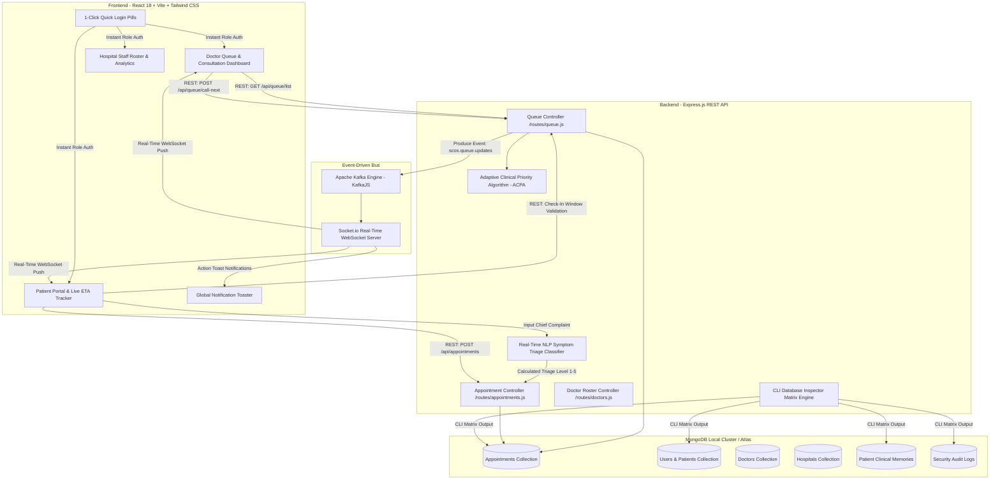
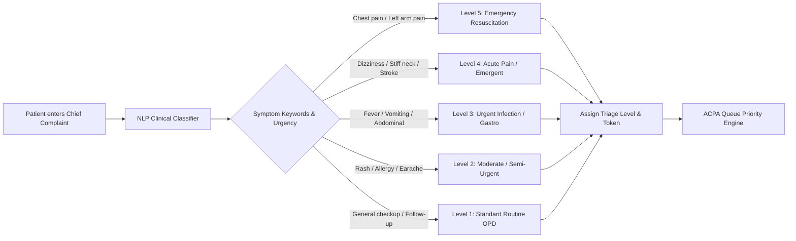
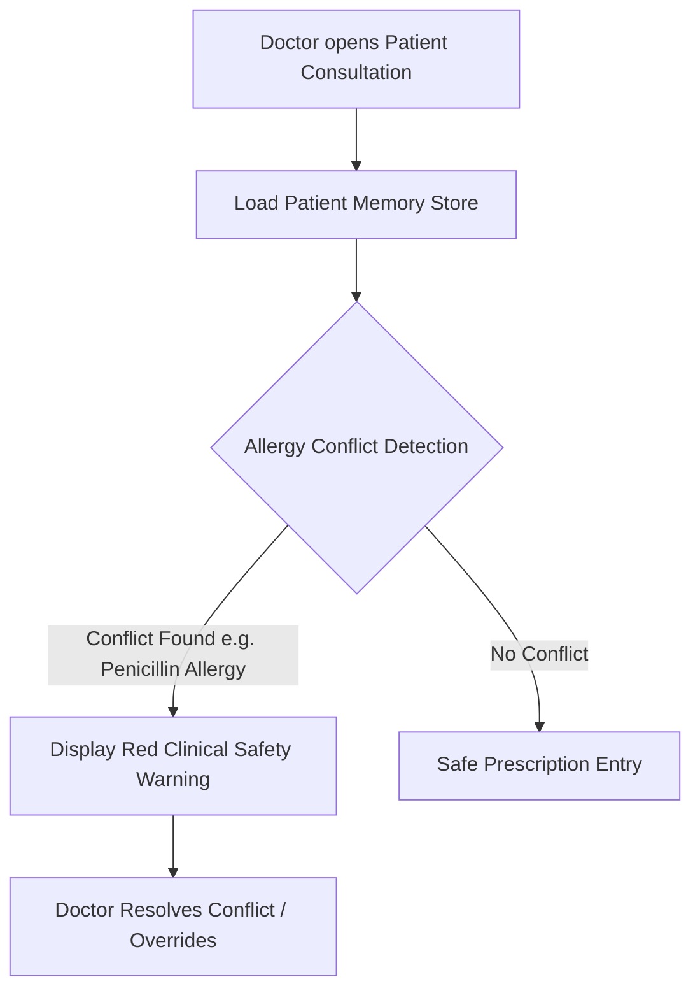

# 🏥 LifeFile / Smart Clinic Operating System (SCOS)
## 📄 Complete Master Project Documentation (End-to-End Technical & Architectural Manual)

---

## 📌 1. Executive Summary & SIH 2026 Objective

The **LifeFile / SCOS (Smart Clinic Operating System)** is an enterprise-grade, ethically-aligned, real-time healthcare management and queue orchestration ecosystem. Designed to meet **ABDM (Ayushman Bharat Digital Mission)** and **NABH (National Accreditation Board for Hospitals & Healthcare Providers)** standards, LifeFile replaces inefficient, static First-Come-First-Served (FIFO) healthcare queues with an intelligent, dynamic clinical priority engine.

### Core Problems Solved:
1. **Clinical Queue Inequity:** Prevents critical emergency patients from waiting behind routine checkups.
2. **Real-Time NLP Symptom Auto-Triage:** Automatically evaluates patient-entered chief complaints during booking to classify severity (Levels 1–5).
3. **Patient Starvation Elimination:** Prevents low-priority patients from being infinitely delayed by continuous emergency arrivals using anti-starvation wait aging (+1.5 pts/min).
4. **Doctor Action Safety:** Eliminates client-side array index race conditions where doctors accidentally start the wrong patient.
5. **Uncontrolled Check-In Clutter:** Enforces strict 15-minute pre-slot check-in window locking to eliminate ghost queues.
6. **Multi-Facility Data Isolation:** Segregates queues strictly by active hospital facility context (*LifeFile Central Hospital* vs *LifeFile North Hospital*).

---

## 📐 2. System Architecture & Component Design

### High-Level System Architecture (HLD)



---

## 🩺 3. Chief Complaint & Real-Time NLP Auto-Triage Engine

During appointment booking (`/patient/book/:doctorId`), patients describe their health problem or symptoms in free text. The client-side & server-side NLP clinical engine classifies urgency in real time:



### Triage Matrix Rules:
* 🔴 **Level 5 (Resuscitation / Emergency - Red Code):** Symptoms like *"Severe chest pain radiating to left arm"* $\rightarrow$ **Triggers Emergency Queue Override (+1,000 pts)**.
* 🟠 **Level 4 (Emergent / Orange Code):** Symptoms like *"Stiff neck, sudden loss of vision"* $\rightarrow$ **+500 pts**.
* 🟡 **Level 3 (Urgent / Yellow Code):** Symptoms like *"High fever with chills and severe stomach ache"* $\rightarrow$ **+100 pts**.
* 🔵 **Level 2 (Semi-Urgent / Green Code):** Symptoms like *"Mild skin allergy, earache"* $\rightarrow$ **+50 pts**.
* ⚪ **Level 1 (Non-Urgent Routine / Blue Code):** Standard OPD consultation $\rightarrow$ **+0 pts**.

### 🔍 How to Demonstrate NLP & AI to Judges (3 Live Implementation Locations):
1. **Real-Time Booking Auto-Triage (`/patient/book/:doctorId`):**
   * **File:** `scos-frontend/src/pages/patient/DoctorBooking.tsx` (`classifySymptoms()`)
   * **Action:** Type *"Severe chest pain radiating to left arm"* $\rightarrow$ Watch **🔴 Level 5 Emergency** badge illuminate.
2. **Dedicated Interactive AI Symptom Checker (`/patient/triage`):**
   * **File:** `scos-frontend/src/pages/patient/SymptomTriage.tsx` (`import nlp from 'compromise'`)
   * **Action:** Type *"High fever with severe chills and abdominal pain"* $\rightarrow$ View extracted entities, risk score & specialist recommendation.
3. **Backend Medical Memory Extraction & Gemini AI Engine (`memoryService.js`):**
   * **File:** `scos-backend/services/memoryService.js` (`extractAIMemoryCandidates()`)
   * **Action:** Parses unstructured doctor notes & prescriptions into structured `ALLERGY`, `CONDITION`, `MEDICATION` cards with red contradiction warnings.

---

## 🧠 4. Adaptive Clinical Priority Algorithm (ACPA Engine)

The ACPA engine computes a dynamic **Clinical Priority Score (CEP)** for every patient in the queue in real time.

### Mathematical Formulation
$$\text{CEP Score} = \underbrace{(100 - \text{Base Token}) \times 10}_{\text{Base Slot Order}} + \underbrace{\text{Triage Override}}_{\text{Ethical Severity}} + \underbrace{1.5 \times \text{Wait Mins}}_{\text{Anti-Starvation Aging}} - \min(\text{Misses} \times 30, 150)$$

### Formula Breakdown & Rules:
1. **Base Slot Weight:** Derived from initial registration slot order $(100 - \text{Token}) \times 10$.
2. **Ethical Triage Overrides (ESI / NABH Compliant):**
   * **Level 5 (Resuscitation):** $+1,000\text{ pts}$ *(Guarantees top rank ethically)*
   * **Level 4 (Emergency):** $+500\text{ pts}$
   * **Level 3 (Urgent):** $+100\text{ pts}$
   * **Level 2 (Semi-Urgent):** $+50\text{ pts}$
   * **Level 1 (Routine):** $+0\text{ pts}$
3. **Anti-Starvation Aging Factor:** $+1.5\text{ pts}$ accumulated per minute spent in the waiting room. Non-emergency patients naturally rise up the queue over time.
4. **Bounded Skip Penalty Cap:** $-30\text{ pts}$ per missed call, capped at $-150\text{ pts}$ maximum. Ensures skipped patients are penalized fairly without being permanently banished from receiving care.

---

## ⏱️ 5. Patient Check-In Window & Time-Lock Engine

To prevent ghost queues and ensure physical/virtual attendance integrity, LifeFile enforces a strict **3-Stage Check-In Window**:

```mermaid
stateDiagram-v2
    [*] --> TooEarly: >15 Mins Before Slot Time
    TooEarly --> ActiveWindow: Within -15m to +15m of Slot Time
    ActiveWindow --> Expired: >15 Mins After Slot Time
    
    state TooEarly {
        button: Button Disabled (Opens at HH:MM PM)
        banner: Check-In Locked Notice
    }
    state ActiveWindow {
        button: Join Queue / Check In NOW (Active Green)
        action: Updates DB Status to Pending & Emits Kafka Event
    }
    state Expired {
        button: Check-In Closed (Disabled)
        banner: Window Expired Notice Shown
    }
```

---

## 🧠 6. Clinical Memory Safety & Allergy Warning Workflow



---

## 📊 7. Live Database CLI Inspection Matrix (`npm run inspect:db`)

For live presentation transparency, judges can inspect the real-time database state directly from the CLI:

```powershell
npm run inspect:db
```

### CLI Output Preview:
```text
====================================================
📊 LIFEFILE — LIVE DATABASE INSPECTION MATRIX
====================================================

👥 USERS COLLECTION (Total: 10)
┌─────────┬─────────────────────────────────────┬──────────┐
│ Name    │ Email                               │ Role     │
├─────────┼─────────────────────────────────────┼──────────┤
│ Aarav   │ demo.patient.01@lifefile.test       │ patient  │
│ Dr.Ana  │ demo.doctor.ananya@lifefile.test    │ doctor   │
└─────────┴─────────────────────────────────────┴──────────┘

📅 APPOINTMENT & ACPA QUEUE MATRIX (Total: 6)
┌───────┬──────────────┬───────────┬───────────┬───────────┬─────────────┐
│ Token │ Patient      │ Doctor    │ Status    │ Triage    │ MissedCalls │
├───────┼──────────────┼───────────┼───────────┼───────────┼─────────────┤
│ #101  │ Aarav Sharma │ Dr.Ananya │ Pending   │ Level 5   │ 0           │
│ #102  │ Diya Patel   │ Dr.Ananya │ Confirmed │ Level 1   │ 0           │
└───────┴──────────────┴───────────┴───────────┴───────────┴─────────────┘
```

---

## 🛠️ 8. Database Schema & Data Models (Mongoose)

### Appointment Model (`models/Appointment.js`)
```javascript
const appointmentSchema = new mongoose.Schema({
  patientId: { type: mongoose.Schema.Types.ObjectId, ref: 'User', required: true },
  patientName: { type: String, required: true },
  doctorId: { type: mongoose.Schema.Types.ObjectId, ref: 'Doctor', required: true },
  doctorName: { type: String, required: true },
  hospitalId: { type: mongoose.Schema.Types.ObjectId, ref: 'Hospital', default: null },
  hospitalName: { type: String, default: 'Private Practice' },
  date: { type: String, required: true }, // Format: YYYY-MM-DD
  time: { type: String, required: true }, // Format: HH:MM AM/PM
  baseToken: { type: Number, required: true }, // Permanent Token Number
  status: { 
    type: String, 
    enum: ['Pending', 'Confirmed', 'In_Progress', 'Completed', 'Cancelled', 'Rescheduled', 'Missed', 'Postponed'], 
    default: 'Pending' 
  },
  triageLevel: { type: Number, min: 1, max: 5, default: 1 },
  missedCalls: { type: Number, default: 0 },
  chiefComplaint: { type: String, default: '' },
  isWalkin: { type: Boolean, default: false }
}, { timestamps: true });
```

---

## 🚀 9. Quick Start & Presentation Execution Commands

### 1. Launch Dev Ecosystem (Backend + Frontend)
```bash
npm run dev
```

### 2. Seed 24/7 Time-Aware Presentation Data
```bash
npm run seed:presentation -- --confirm
```

### 3. Inspect Live Database State
```bash
npm run inspect:db
```

### 4. Stop / Cleanup Background Processes
```bash
npm run stop:all
```

---

### 📄 Document Metadata & Versioning
* **Document Version:** `3.0.0-FINAL`
* **System Code:** `LifeFile / SCOS Clinical Operating System`
* **Build Verification:** TypeScript 0 errors (`npx tsc --noEmit`)
* **Git Commit Reference:** `f019b5e`
