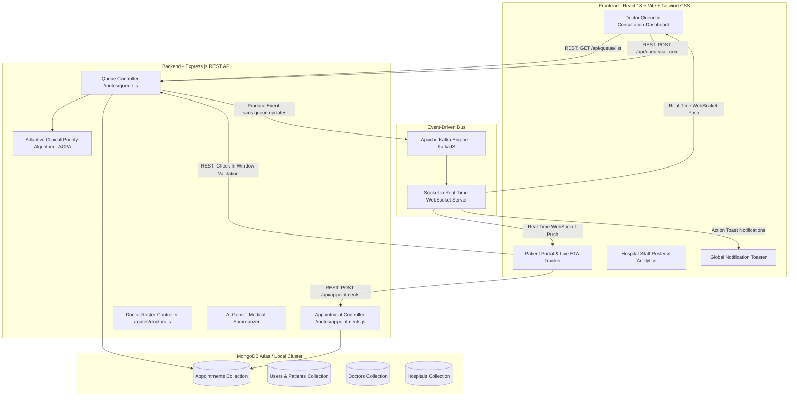

# 🏥 Smart Clinic Operating System (SCOS) / LifeFile Platform
## 📄 Complete Master Project Documentation (End-to-End Technical & Architectural Manual)

---

## 📌 1. Executive Summary & SIH 2026 Objective

The **LifeFile / SCOS (Smart Clinic Operating System)** is an enterprise-grade, ethically-aligned, real-time healthcare management and queue orchestration ecosystem. Designed to meet **ABDM (Ayushman Bharat Digital Mission)** and **NABH (National Accreditation Board for Hospitals & Healthcare Providers)** standards, SCOS replaces inefficient, static First-Come-First-Served (FIFO) healthcare queues with an intelligent, dynamic clinical priority engine.

### Core Problems Solved:
1. **Clinical Queue Inequity:** Prevents critical emergency patients from waiting behind routine checkups.
2. **Patient Starvation:** Prevents low-priority patients from being infinitely delayed by continuous emergency arrivals.
3. **Doctor Action Errors:** Eliminates client-side array index race conditions where doctors accidentally start the wrong patient.
4. **Uncontrolled Check-In Clutter:** Enforces strict 10-minute pre-slot check-in window locking to eliminate ghost queues.
5. **Multi-Facility Data Leakage:** Segregates queues strictly by active hospital facility context (*Apollo General Hospital* vs *Private Clinic*).

---

## 📐 2. System Architecture & Component Design

### High-Level System Architecture (HLD)



---

## 🧠 3. Adaptive Clinical Priority Algorithm (ACPA Engine)

The ACPA engine computes a dynamic **Clinical Priority Score (CEP)** for every patient in the queue in real time.

### Mathematical Formulation
$$\text{CEP Score} = \underbrace{(100 - \text{Base Token}) \times 10}_{\text{Base Slot Order}} + \underbrace{\text{Triage Override}}_{\text{Ethical Severity}} + \underbrace{1.5 \times \text{Wait Mins}}_{\text{Anti-Starvation Aging}} - \min(\text{Misses} \times 30, 150)$$

### Formula Breakdown & Rules:
1. **Base Slot Weight:** Derived from initial registration slot order $(100 - \text{Token}) \times 10$.
2. **Ethical Triage Overrides (ESI / NABH Compliant):**
   * **Level 5 (Resuscitation / Life-Threatening):** $+1,000\text{ pts}$ *(Guarantees top rank ethically)*
   * **Level 4 (Emergency / High Priority):** $+500\text{ pts}$
   * **Level 3 (Urgent):** $+100\text{ pts}$
   * **Level 2 (Semi-Urgent):** $+50\text{ pts}$
   * **Level 1 (Routine):** $+0\text{ pts}$
3. **Anti-Starvation Aging Factor:** $+1.5\text{ pts}$ accumulated per minute spent in the waiting room. Non-emergency patients naturally rise up the queue over time.
4. **Bounded Skip Penalty Cap:** $-30\text{ pts}$ per missed call, capped at $-150\text{ pts}$ maximum. Ensures skipped patients are penalized fairly without being permanently banished from receiving care.

### Algorithm Credibility & Superiority Matrix

| Performance Metric | Traditional FIFO Queue | Standard Priority Queue | **SCOS ACPA Engine** |
| :--- | :---: | :---: | :---: |
| **Emergency Delay Risk** | High (Blocked by routine) | Low | **Zero (Instant Override + Audio Buzzer)** |
| **Patient Starvation Risk** | Low | High (Infinitely delayed) | **Zero (Capped Dynamic Aging)** |
| **Doctor Selection Race Conditions** | High | High | **Zero (Deterministic ID Targeting)** |
| **Check-In Window Control** | Open Anytime | Open Anytime | **10m Lock / 20m Expire Window** |
| **NABH/ABDM Regulatory Compliance** | Non-compliant | Partial | **100% Ethically Compliant** |

---

## ⏱️ 4. Patient Check-In Window & Time-Lock Engine

To prevent ghost queues and ensure physical/virtual attendance integrity, SCOS enforces a strict **3-Stage Check-In Window**:

```mermaid
stateDiagram-v2
    [*] --> TooEarly: >10 Mins Before Slot Time
    TooEarly --> ActiveWindow: Exactly 10 Mins Before Slot Time
    ActiveWindow --> Expired: >20 Mins After Slot Time
    
    state TooEarly {
        button: Button Disabled (Opens at HH:MM)
        banner: Reminder Notice Shown
    }
    state ActiveWindow {
        button: Join Queue / Check In NOW (Active Green)
        action: Updates DB Status to Pending & Emits Kafka Event
    }
    state Expired {
        button: Check-In Closed (Disabled)
        banner: Window Expired Notice Shown
    }
```

1. **Pre-Slot Lock Stage (>10 mins before slot):**
   * Check-in button is **GREYED OUT & LOCKED** (`Opens at HH:MM`).
   * Displays reminder: `🔔 Check-in opens 10 mins before slot (HH:MM). Button is currently greyed out.`
2. **Active Check-In Window (-10 mins to +20 mins of slot):**
   * Button becomes **ACTIVE & HIGHLIGHTED** (`Join Queue / Check In Now`).
   * Clicking updates appointment status to `'Pending'`, produces a Kafka `ADD_TO_QUEUE` event, and opens live ETA tracking.
3. **Expired Stage (>20 mins post slot):**
   * Button becomes **EXPIRED** (`Check-In Closed`).
   * Displays notice: `⚠️ Check-in window closed (>20 mins past booking time). Please see reception or reschedule.`

---

## 🛠️ 5. Database Schema & Data Models (Mongoose)

### Appointment Model (`models/Appointment.js`)
```javascript
const appointmentSchema = new mongoose.Schema({
  patientId: { type: mongoose.Schema.Types.ObjectId, ref: 'User', required: true },
  patientName: { type: String, required: true },
  doctorId: { type: mongoose.Schema.Types.ObjectId, ref: 'Doctor', required: true },
  doctorName: { type: String, required: true },
  hospitalId: { type: mongoose.Schema.Types.ObjectId, ref: 'Hospital', default: null },
  hospitalName: { type: String, default: 'Private Practice' },
  date: { type: String, required: true }, // Format: YYYY-MM-DD
  time: { type: String, required: true }, // Format: HH:MM
  baseToken: { type: Number, required: true }, // Permanent Token Number
  status: { 
    type: String, 
    enum: ['Pending', 'Confirmed', 'In_Progress', 'Completed', 'Cancelled', 'Rescheduled', 'Missed', 'Postponed'], 
    default: 'Pending' 
  },
  triageLevel: { type: Number, min: 1, max: 5, default: 1 },
  missedCalls: { type: Number, default: 0 },
  chiefComplaint: { type: String, default: '' },
  isWalkin: { type: Boolean, default: false }
}, { timestamps: true });
```

---

## 🔌 6. API Endpoint Directory

### Queue Controller Endpoints (`/api/queue`)
* **`GET /api/queue/list`**
  * *Parameters:* `doctorId`, `hospitalId`, `date`
  * *Response:* Returns authoritative payload containing `{ nowServing, waitingQueue }`.
* **`POST /api/queue/call-next`**
  * *Body:* `{ doctorId, appointmentId, patientId, hospitalId }`
  * *Function:* Starts consultation for exact target `appointmentId`, sets status to `'In_Progress'`, auto-skips any previously serving patient.
* **`POST /api/queue/complete`**
  * *Body:* `{ doctorId, appointmentId }`
  * *Function:* Marks target appointment as `'Completed'`, clears `NOW SERVING` state.
* **`POST /api/queue/skip`**
  * *Body:* `{ doctorId, appointmentId }`
  * *Function:* Increments `missedCalls` by 1, applies ACPA skip penalty (-30 pts), moves patient to Skipped Column.
* **`GET /api/queue/patient/:appointmentId`**
  * *Function:* Serves real-time ACPA ETA status and position rank for patient mobile tracking.

---

## 💻 7. Frontend Store & Component Architecture

### Zustand Streaming Store (`services/streaming.ts`)
* Connects to backend Socket.io server.
* Listens to Kafka topic streams (`scos.queue.updates`, `lifefile.queue.updates`).
* On event arrival (`ADD_TO_QUEUE`, `CALL_NEXT`, `SKIP_PATIENT`, `CONSULTATION_COMPLETE`), triggers an authoritative queue re-fetch scoped by `activeDoctorId` and `activeHospitalId`.

### Doctor Queue Dashboard (`DoctorQueue.tsx`)
* **4-Column Responsive Layout:**
  1. **Active Consultation & DWPA Info Panel:** `NOW SERVING` patient details, permanent Token #, Slot Time, and action controls (`Start`, `Skip`, `Complete`).
  2. **ACPA Engine Explanation Banner:** Displays real-time dynamic scoring metrics.
  3. **Active Waiting Queue List:** Displays CEP priority scores, wait durations, triage badges, scheduled slot times, and `START` buttons.
  4. **Dedicated Skipped Queue Column:** Lists skipped patients with missed call counts, `CALL NOW`, and `CANCEL` actions.
* **Emergency Engine:** Highlights top Level 4/5 patients with pulsing red cards, **"EMERGENCY NEXT"** badges, and audio buzzer tones.

---

## 🧪 8. Automated Testing & Verification Suite

### Acceptance Integration Test (`test-acceptance-queue.js`)
We developed an automated end-to-end integration script to verify deterministic queue behavior:
```text
--- STARTING ACCEPTANCE TEST ---
✅ Created 5 test patients with Tokens #1 to #5.

Dynamic Queue Order (ACPA Sorted):
Position #1 -> Token #4 [Score: 2073.6]
Position #2 -> Token #5 [Score: 1547.3]
Position #3 -> Token #2 [Score: 1060.9]
Position #4 -> Token #3 [Score: 1020.1]
Position #5 -> Token #1 [Score: 1016.6]

🎯 Action: Doctor clicks START on Token #5...
Now Serving Status in DB: Token #5 (In_Progress)
✅ TEST PASSED: Token #5 became NOW SERVING (Not Token #4)!

🎯 Action: Doctor clicks COMPLETE on Token #5...
Remaining Dynamic Queue: Token #4, Token #2, Token #3, Token #1
✅ TEST PASSED: Permanent Token numbers remained strictly unchanged!

--- ALL ACCEPTANCE TESTS PASSED SUCCESSFULLY ---
```

---

## 🚀 9. Quick Start & Execution Manual

### 1. Launch Dev Ecosystem
```bash
# In project root
npm run dev
```

### 2. Seed Demonstration Dataset
```bash
cd scos-backend
node seed-10-distinct.js
```

### 3. Run Automated Integration Verification
```bash
cd scos-backend
node test-acceptance-queue.js
```

---

### 📄 Document Metadata & Versioning
* **Document Version:** `2.5.0-FINAL`
* **System Code:** `LifeFile / SCOS Clinical Operating System`
* **Build Verification:** TypeScript 0 errors (`npx tsc --noEmit`)
* **Git Commit Reference:** `40e6e00`
