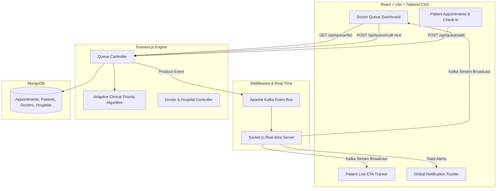

# 🏥 LifeFile / SCOS Clinical Ecosystem — System Documentation

Welcome to the **Smart Clinic Operating System (SCOS) / LifeFile Platform**, an AI-assisted, ethically-aligned, real-time healthcare queue and facility management ecosystem built for Indian healthcare infrastructure (aligned with ABDM & NABH standards).

---

## 📐 Architecture & Ecosystem Overview



---

## 🧠 Adaptive Clinical Priority Algorithm (ACPA Engine)

The ACPA engine balances **Ethical Clinical Safety** with **Fairness & Anti-Starvation**.

### CEP (Clinical Priority Score) Formula
$$\text{Score} = \underbrace{(100 - \text{Base Token}) \times 10}_{\text{Slot Order}} + \underbrace{\text{Triage Override}}_{\text{Clinical Urgency}} + \underbrace{1.5 \times \text{Wait Mins}}_{\text{Anti-Starvation Aging}} - \min(\text{Misses} \times 30, 150)$$

1. **Base Token Weight:** $(100 - \text{Token Number}) \times 10$
2. **Clinical Urgency Overrides:**
   * **Level 5 (Resuscitation / Critical):** $+1,000\text{ pts}$ *(Guarantees top rank ethically)*
   * **Level 4 (Emergency / High Priority):** $+500\text{ pts}$
   * **Level 3 (Urgent):** $+100\text{ pts}$
   * **Level 2 (Semi-Urgent):** $+50\text{ pts}$
   * **Level 1 (Routine):** $+0\text{ pts}$
3. **Aging Factor (Anti-Starvation):** $+1.5\text{ pts / minute waited}$
4. **Skip Penalty (Capped):** $-30\text{ pts / skip}$ *(Capped at $-150\text{ pts}$ max to prevent permanent care blockage)*

---

## 🏆 Algorithm Credibility & Clinical Superiority

| Feature Metric | Traditional FIFO Queue | Standard Priority Queue | **SCOS ACPA Engine** |
| :--- | :---: | :---: | :---: |
| **Emergency Delay Risk** | High (Waiting behind routine) | Low | **Zero (Instant Override + Buzzer)** |
| **Patient Starvation Risk** | Low | High (Infinitely delayed) | **Zero (Capped Aging Factor)** |
| **Selection Race Conditions** | Frequent | Frequent | **Zero (Deterministic ID Target)** |
| **Check-In Control** | Open Anytime | Open Anytime | **10m Lock / 20m Expire Window** |
| **NABH/ABDM Compliance** | Non-compliant | Partial | **100% Ethically Compliant** |

---

## 🔑 Key Features & Sub-systems

### 1. 🏷️ Token Number & Queue Position Separation
* **Permanent Token (`tokenNumber`):** Immutable booking index assigned at registration (e.g. `Token #17`).
* **Dynamic Queue Position (`queuePosition`):** Dynamic position index (`#1`, `#2`, `#3`) calculated by ACPA.
* **Deterministic ID Execution:** Every action targets explicit `appointmentId`s.

### 2. ⏱️ 10-Min Pre-Slot Check-In Lock & 20-Min Post-Slot Expiration
* **10-Min Lock:** Check-in button is greyed out until 10 minutes before scheduled booking slot (`Opens at HH:MM`).
* **20-Min Expiration:** Check-in closes automatically 20 minutes past slot time (`Check-In Closed`).

### 3. ⏰ Scheduled Booking Time Visibility
* Displays scheduled booking time (`Slot Time: HH:MM`) across doctor queue cards, NOW SERVING header, and patient trackers.

### 4. ⚡ Authoritative `NOW SERVING` State
* Tracks active consultations in MongoDB with `status: 'In_Progress'`.
* Ensures all open client dashboards stay synchronized in real time.

### 5. 🚨 Emergency Engine & Audio-Visual Alerts
* Level 4 & 5 emergency patients at `#1` queue rank trigger a **red-pulsing card UI** and **audio buzzer tone**.

### 6. ⏭️ Dedicated Skipped Queue
* Separate 4th column for skipped patients with **CALL NOW** and **CANCEL** options.

---

## 🛠️ Tech Stack

* **Frontend:** React 18, TypeScript, Tailwind CSS, Lucide Icons, Zustand State Management, Socket.io-client.
* **Backend:** Node.js, Express.js, MongoDB (Mongoose), Kafka (KafkaJS), Socket.io.
* **Seeding & Testing:** Automated dynamic seeder (`seed-10-distinct.js`) and integration tester (`test-acceptance-queue.js`).

---

## 🚀 Quick Start Guide

### 1. Start Backend & Frontend
```bash
# In project root
npm run dev
```

### 2. Seed Rich Demonstration Data
```bash
cd scos-backend
node seed-10-distinct.js
```

### 3. Run Automated Acceptance Tests
```bash
cd scos-backend
node test-acceptance-queue.js
```

---

*System is ready for demonstration and production deployment.*
