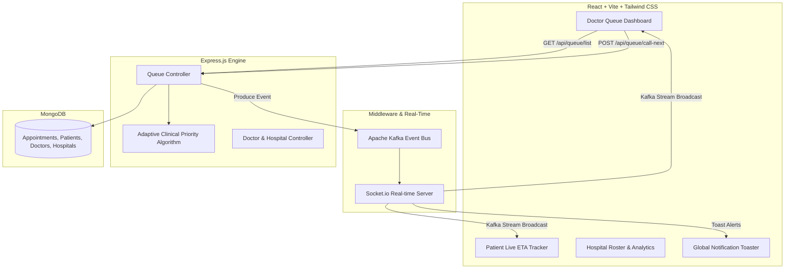

# 🏥 LifeFile / SCOS Clinical Ecosystem — System Documentation

Welcome to the **Smart Clinic Operating System (SCOS) / LifeFile Platform**, an AI-assisted, ethically-aligned, real-time healthcare queue and facility management ecosystem built for Indian healthcare infrastructure (aligned with ABDM & NABH standards).

---

## 📐 Architecture & Ecosystem Overview



---

## 🧠 Adaptive Clinical Priority Algorithm (ACPA Engine)

The ACPA engine balances **Ethical Clinical Safety** with **Fairness & Anti-Starvation**.

### CEP (Clinical Priority Score) Formula
$$\text{Score} = \text{Slot Weight} + \text{Aging Weight} + \text{Clinical Override} - \text{Penalty}$$

1. **Base Token Weight:** $(100 - \text{Token Number}) \times 10$
2. **Clinical Urgency Overrides:**
   * **Level 5 (Resuscitation / Critical):** $+1,000\text{ pts}$ *(Guarantees top rank ethically)*
   * **Level 4 (Emergency / High Priority):** $+500\text{ pts}$
   * **Level 3 (Urgent):** $+100\text{ pts}$
   * **Level 2 (Semi-Urgent):** $+50\text{ pts}$
   * **Level 1 (Routine):** $+0\text{ pts}$
3. **Aging Factor (Anti-Starvation):** $+1.5\text{ pts / minute waited}$
4. **Skip Penalty (Capped):** $-30\text{ pts / skip}$ *(Capped at $-150\text{ pts}$ max to prevent permanent care blockage)*

---

## 🔑 Key Features & Sub-systems

### 1. 🏷️ Token Number & Queue Position Separation
* **Permanent Token (`tokenNumber`):** Immutable booking index assigned at registration (e.g. `Token #17`).
* **Dynamic Queue Position (`queuePosition`):** Dynamic position index (`#1`, `#2`, `#3`) calculated by ACPA.
* **Deterministic ID Execution:** Every action targets explicit `appointmentId`s.

### 2. ⚡ Authoritative `NOW SERVING` State
* Tracks active consultations in MongoDB with `status: 'In_Progress'`.
* Ensures all open client dashboards stay synchronized in real time.

### 3. 🚨 Emergency Engine & Audio-Visual Alerts
* Level 4 & 5 emergency patients at `#1` queue rank trigger a **red-pulsing card UI** and **audio buzzer tone**.

### 4. ⏭️ Dedicated Skipped Queue
* Separate 4th column for skipped patients with **CALL NOW** and **CANCEL** options.

### 5. 🏥 Facility Isolation
* Segregates hospital facilities (`Apollo General`) and `Private Clinic` context.

---

## 🛠️ Tech Stack

* **Frontend:** React 18, TypeScript, Tailwind CSS, Lucide Icons, Zustand State Management, Socket.io-client.
* **Backend:** Node.js, Express.js, MongoDB (Mongoose), Kafka (KafkaJS), Socket.io.
* **Seeding & Testing:** Automated dynamic seeder (`seed-10-distinct.js`) and integration tester (`test-acceptance-queue.js`).

---

## 🚀 Quick Start Guide

### 1. Start Backend & Frontend
```bash
# In project root
npm run dev
```

### 2. Seed Rich Demonstration Data
```bash
cd scos-backend
node seed-10-distinct.js
```

### 3. Run Automated Acceptance Tests
```bash
cd scos-backend
node test-acceptance-queue.js
```

---

*System is ready for demonstration and production deployment.*
